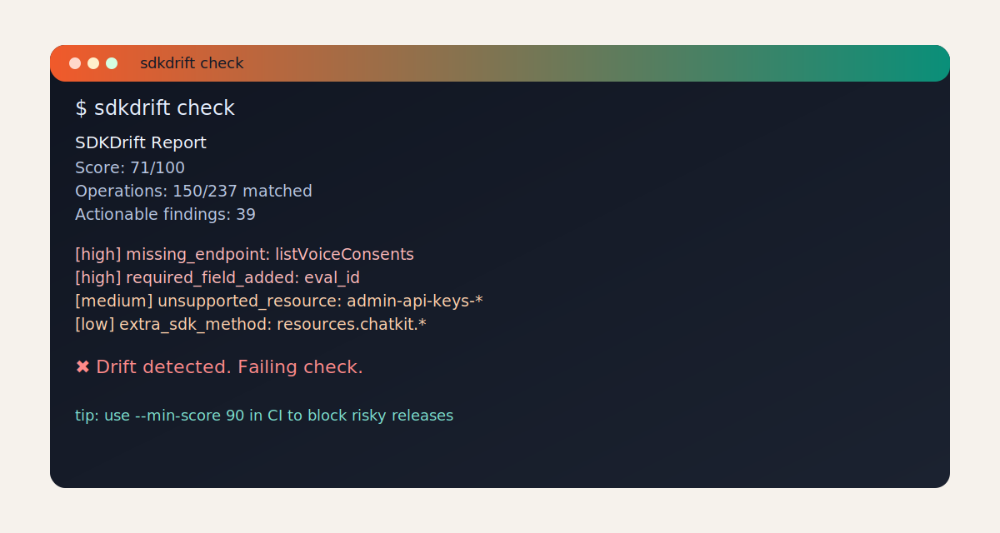

# SDKDrift

Detect when your generated SDKs drift from your OpenAPI spec.

Website: [www.sdkdrift.com](https://www.sdkdrift.com)

[](https://www.npmjs.com/package/@sdkdrift/cli)
[](./LICENSE)
[](https://github.com/dharmarajatulya1-hub/sdkdrift/actions/workflows/ci.yml)

**Topics:** `openapi` `sdk` `drift-detection` `developer-tools` `cli` `code-generation` `api`

SDKDrift detects drift between your OpenAPI contract and generated SDK surface, reports actionable mismatches, and gives you a score you can gate in CI.

## Highlights

- Reusable **GitHub Action wrapper** for CI gating in any repo
- Drift findings split into actionable issues vs coverage notes
- Configurable score threshold (`--min-score`) for release blocking

## Demo



Asciicast (optional): `https://asciinema.org/a/<cast-id>`

```bash
sdkdrift scan --spec ./demo/openapi.yaml --sdk ./demo/sdk/python --lang python
```

## Quick Start (3 commands)

```bash
npm install -g sdkdrift
sdkdrift scan --help
sdkdrift scan --spec ./demo/openapi.yaml --sdk ./demo/sdk/python --lang python
```

## Works With

- Stainless
- Speakeasy
- OpenAPI Generator
- Swagger Codegen
- Fern
- Custom in-house generators

## What It Solves

When your API spec evolves faster than generated SDKs, users hit missing methods, required-parameter breaks, and type mismatches.
SDKDrift catches this before release.

## CLI

```bash
sdkdrift scan --spec <pathOrUrl> --sdk <path> --lang <python|ts> [options]
```

### Options

- `--spec <pathOrUrl>`: OpenAPI file path or URL
- `--sdk <path>`: SDK root directory
- `--lang <python|ts>`: language scanner
- `--format <terminal|json|markdown>`: output format (default `terminal`)
- `--config <path>`: config file path (`sdkdrift.config.yaml`)
- `--out <path>`: write report to file
- `--min-score <0..100>`: fail process when score is lower than threshold
- `--verbose`: emit matcher diagnostics to stderr
- `--compat-v1`: emit v1-compatible JSON schema when `--format json` is used

### Exit Codes

- `0`: success and score >= threshold
- `1`: runtime/config/parse error
- `2`: score below `--min-score`

## Config (`sdkdrift.config.yaml`)

```yaml
match:
  heuristicThreshold: 0.55
  mode: precision
  minConfidenceActionable: 0.7
  minTop2Margin: 0.08
  abstainOverGuess: true
mapping:
  overrides:
    - operationId: listUsers
      sdkMethod: UsersApi.fetch_users
diff:
  ignore:
    extraMethods:
      - "MiscApi\\.debug_trace"
```

Validation rules: `CONFIG_SPEC.md`

## Output Example

```text
SDKDrift Report
Score: 92/100
Operations: 1/2 matched
Findings: 1
- [high] missing_endpoint: Operation getUser is not represented in SDK
```

JSON contract stability: `SCHEMA.md`

## CI Usage

```yaml
name: SDK Drift Check
on: [push]
jobs:
  drift:
    runs-on: ubuntu-latest
    steps:
      - uses: actions/checkout@v4
      - uses: actions/setup-node@v4
        with:
          node-version: 20
      - run: npx @sdkdrift/cli scan --spec ./openapi.yaml --sdk ./sdk/python --lang python --min-score 90
```

## GitHub Action Wrapper

Use SDKDrift directly as a reusable GitHub Action:

```yaml
name: SDK Drift Check
on: [pull_request]

jobs:
  sdkdrift:
    runs-on: ubuntu-latest
    steps:
      - uses: actions/checkout@v4
      - uses: dharmarajatulya1-hub/sdkdrift@main
        with:
          spec: ./openapi.yaml
          sdk: ./sdk/python
          lang: python
          min-score: 90
          format: json
          out: sdkdrift.report.json
```

What this wrapper does:

1. Sets up Node.
2. Runs `npx @sdkdrift/cli scan ...` with your inputs.
3. Generates a markdown summary from JSON output and publishes it in the workflow Summary UI.
4. Optionally uploads the generated report and markdown summary as workflow artifacts.
4. Fails the job if SDKDrift exits non-zero (including score threshold failures).

Recommended usage:

- Pin to a release tag instead of `main` in production workflows.
- Use `format: json` with `out:` for machine-readable artifacts.
- Set `min-score` so PRs fail when drift exceeds your tolerance.

Supported action inputs:

- `spec` (required): OpenAPI path/URL
- `sdk` (required): SDK directory
- `lang` (required): `python` or `ts`
- `min-score` (optional): fail threshold
- `format` (optional): `terminal|json|markdown` (default `terminal`)
- `config` (optional): config path
- `out` (optional): report path (default `sdkdrift.report.json`)
- `verbose` (optional): `true|false`
- `cli-version` (optional): npm version, default `latest`
- `node-version` (optional): default `20`
- `working-directory` (optional): default `.`
- `upload-artifact` (optional): default `true`
- `artifact-name` (optional): default `sdkdrift-report`
- `publish-summary` (optional): generate markdown summary from JSON output, default `true`
- `summary-file` (optional): summary markdown path, default `sdkdrift.summary.md`
- `summary-max-findings` (optional): actionable findings shown in summary, default `10`
- `summary-artifact-name` (optional): summary artifact name, default `sdkdrift-summary`

## Packages

- `@sdkdrift/cli`: command-line interface
- `@sdkdrift/core`: parser, matcher, diff, scoring engine
- `@sdkdrift/python-scanner`: language scanner package

## Benchmark and Calibration

- `npm run benchmark:run`: evaluates pinned real-world reports plus gold labels.
- `npm run benchmark:gold:sync`: syncs benchmark findings into the gold dataset.
- `npm run benchmark:gold:promote`: promotes bootstrap records to `reviewed_auto` for calibration coverage.
- Gold labels file: `benchmark/gold/labeled-operations.v1.json`
- Manifest and gates: `benchmark.manifest.json`

## Repository Layout

- `packages/core`: parsing, matching, diffing, scoring
- `packages/cli`: command orchestration and output
- `packages/python-scanner`: scanner runtime
- `packages/landing`: marketing/waitlist site
- `fixtures`: fixture matrix for behavior validation
- `tests`: smoke and fixture test runner

## Docs Index

- `STATUS.md`: project execution status
- `SCHEMA.md`: JSON report contract
- `CONFIG_SPEC.md`: config contract
- `MIGRATION_V2.md`: v2 rollout and compatibility mode
- `SCORE_MODEL_V2.md`: scoring model details
- `BENCHMARK_GOLD_WORKFLOW.md`: gold-label lifecycle and calibration workflow
- `VALIDATION_REPORT.md`: latest validation summary
- `RELEASE.md`: release and publish guide
- `RELEASE_NOTES_v0.2.0.md`: release notes
- `packages/landing/README.md`: landing env/setup docs

## Troubleshooting

- Config errors: validate `sdkdrift.config.yaml` against `CONFIG_SPEC.md`
- No CLI updates after changes: rebuild or reinstall package
- Waitlist failures: confirm Supabase env vars are set in Vercel project env vars

## License

MIT. See `LICENSE`.
